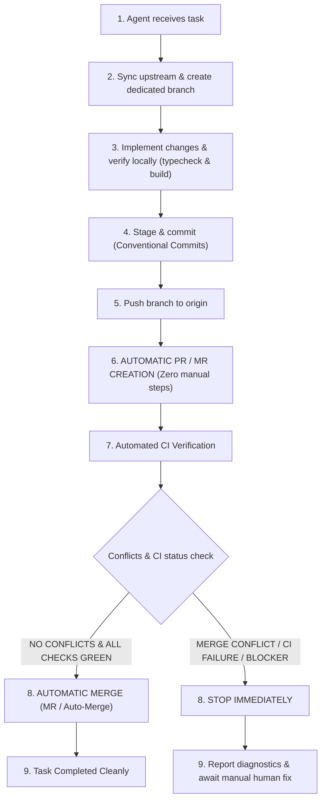

# Agent Git Workflow & Contribution Guidelines

This document defines the mandatory Git workflow for all AI agents (including Antigravity, Claude, Copilot, etc.) and automated tools contributing to this repository.

---

## The Agent Lifecycle Chain

All work in this repository must strictly follow this fully automated sequential chain:



---

## 12 Golden Rules for Agents

1. **Never work directly on `main` (or default branch `master`).**
   - Direct commits to `main`/`master` are strictly prohibited.
2. **Always fetch latest upstream before starting:**
   - Always run `git fetch origin` and ensure your working base is up to date with the remote primary branch (`origin/main` or `origin/master`).
3. **Create a dedicated branch for each task:**
   - Every individual request, bugfix, or feature must live on its own separate branch.
4. **Follow strict branch naming conventions:**
   - `feature/<name>` — New game mechanics, entity systems, UI, networking features.
   - `fix/<name>` — Bug fixes, collision corrections, networking patches.
   - `refactor/<name>` — Code cleanup, architecture improvements without behavior changes.
   - `chore/<name>` — Dependency updates, tooling, configuration updates.
   - `docs/<name>` — Documentation updates only.
   - `test/<name>` — Adding or improving tests.
   *(Use kebab-case for `<name>`, e.g., `feature/altar-interaction`, `fix/projectile-damage-calc`)*.
5. **Write clear Conventional Commits:**
   - Follow the Conventional Commits specification: `feat:`, `fix:`, `refactor:`, `chore:`, `docs:`, `perf:`, etc.
   - Use imperative mood: `"feat(combat): add piercing projectile behavior"` (not `"added piercing projectiles"`).
6. **Always verify build & type check before pushing:**
   - Agents **MUST** execute and verify locally:
     ```bash
     npm run typecheck
     npm run build
     ```
   - Do not push if either check fails. Fix all errors locally before proceeding.
7. **Push the branch to `origin`:**
   - Set the upstream tracking branch on first push: `git push -u origin <branch-name>`.
8. **Automate PR / MR Creation (Zero Manual Effort):**
   - Pull Request (GitHub) and Merge Request (GitLab) creation **MUST be executed automatically**.
   - Agents must not leave PR/MR creation as a manual action for the developer.
   - The PR/MR must target the default branch (`master` or `main`), populated with the commit summary and changes description.
9. **Automatic Merge (MR) on Clean CI; Halt on Conflicts:**
   - **No conflicts & CI Green**: Once CI checks pass and no merge conflicts exist, the PR/MR must be automatically merged into the base branch (using GitHub auto-merge or agent-triggered merge).
   - **Merge Conflicts or CI Failure**: If there is a merge conflict, a broken build/test, or any blocking condition:
     - **STOP IMMEDIATELY.**
     - **DO NOT** attempt to force-merge, bypass branch protections, or repeatedly push speculative blind fixes.
     - Report the exact conflict files or failing test logs to the human developer and await manual intervention.
10. **NEVER force-push (`--force` or `--force-with-lease`):**
    - Prohibited unless explicitly and directly commanded by the user in chat.
11. **Rebase if base branch updated while working:**
    - If the base branch advanced while developing, rebase the feature branch onto `origin/master` (or `origin/main`) before pushing:
      ```bash
      git fetch origin
      git rebase origin/master
      ```
    - Resolve any conflicts locally, re-run verification (`npm run build`), and ensure a clean state.
12. **Keep commits focused and atomic:**
    - Only stage and commit files related to the specific prompt/task.
    - Never include unrelated files, temporary editor files, or accidentally untracked artifacts.

---

## Step-by-Step Command Playbook for Agents

### Step 1: Detect Default Branch & Sync Upstream
Identify the base branch (`main` or `master`) and update local tracking:
```bash
# Check primary branch (default is master or main)
BASE_BRANCH=$(git symbolic-ref refs/remotes/origin/HEAD 2>/dev/null | sed 's@^refs/remotes/origin/@@' || echo "master")

# Fetch latest from remote
git fetch origin

# Switch to base branch and pull latest changes
git checkout $BASE_BRANCH
git pull origin $BASE_BRANCH
```
*(On Windows PowerShell:)*
```powershell
git fetch origin
git checkout master # or main
git pull origin master
```

### Step 2: Create a Dedicated Feature Branch
Branch from the updated base:
```bash
# For a new feature
git checkout -b feature/altar-buff-system

# For a bug fix
git checkout -b fix/enemy-desync-on-chunk-unload

# For refactoring
git checkout -b refactor/binary-snapshot-serializer
```

### Step 3: Implement & Verify Locally
Make your changes, then run verification before staging:
```bash
# 1. Check TypeScript types
npm run typecheck

# 2. Verify Vite production build
npm run build
```

### Step 4: Stage & Commit (Conventional Commits)
Stage only relevant files:
```bash
git add src/world/Altar.ts src/combat/DamageNumberManager.ts
git commit -m "feat(world): add altar interaction buffs and visual indicators"
```

#### Commit Types:
| Prefix | Purpose | Example |
| :--- | :--- | :--- |
| `feat` | New capability or feature | `feat(drops): add automatic gem magnetic attraction` |
| `fix` | Bug fix or error resolution | `fix(net): resolve snapshot buffer overflow during peer disconnect` |
| `refactor`| Code change without behavioral difference | `refactor(entities): simplify enemy state machine transitions` |
| `perf` | Performance improvement | `perf(chunks): optimize spatial hash lookup for drop items` |
| `chore` | Maintenance, dependencies, config | `chore(ci): add build verification workflow` |
| `docs` | Documentation only | `docs: update architecture overview in docs/` |

### Step 5: Check for Upstream Divergence & Rebase
If `origin/master` (or `origin/main`) has new commits:
```bash
git fetch origin
git rebase origin/master
```
If there are conflicts:
1. Resolve conflicts in files.
2. Re-run `npm run typecheck && npm run build`.
3. `git add <resolved-files>`
4. `git rebase --continue`

### Step 6: Push to Origin
```bash
git push -u origin feature/<name>
```

*(On GitLab repositories, push options can automatically create the MR and set auto-merge in a single command):*
```bash
git push -u origin feature/<name> -o merge_request.create -o merge_request.auto_merge -o merge_request.target=master
```

### Step 7: Automatic PR / MR Creation & Auto-Merge Activation

The creation of the Pull Request and queuing of the auto-merge must happen automatically:

#### Method A: GitHub CLI (`gh`)
If GitHub CLI is installed and authenticated:
```bash
# 1. Automatically create the PR targeting default branch
gh pr create --base master --head feature/<name> --title "feat(world): add altar buffs" --body "Automated PR for feature/<name>"

# 2. Automatically queue auto-merge once CI checks pass
gh pr merge feature/<name> --auto --merge
```
*(If `--merge` is restricted, use `--squash` according to repository settings).*

#### Method B: Built-in GitHub Actions Automation (`.github/workflows/auto-pr.yml`)
This repository includes an automated workflow (`.github/workflows/auto-pr.yml`) that triggers on every push to `feature/**`, `fix/**`, `refactor/**`, `chore/**`, `docs/**`, and `test/**`:
- It detects the new branch and automatically creates a Pull Request targeting `master`.
- It activates the `--auto --merge` flag using repository workflow permissions.
- Even if local CLI is unauthenticated, the remote pipeline ensures PR creation and auto-merge require zero human clicks.

### Step 8: CI Evaluation & Stop Protocol

Once the PR is created, CI is triggered via GitHub Actions:
- **Case A: No Conflicts & All Required Checks Pass (GREEN)**
  - The Pull Request auto-merges into the base branch automatically.
  - The agent confirms the successful merge and concludes the task.

- **Case B: Merge Conflict, CI Failure (RED), or Blocker**
  - **STOP IMMEDIATELY.**
  - **DO NOT** attempt to force-merge, bypass required checks, or push speculative workarounds.
  - Formulate a clear diagnosis for the human developer:
    1. Identify conflicting files or failing CI step (e.g. `Build & Verify (Node 22.x)`).
    2. Provide exact error messages, stack trace, or conflict markers.
    3. Suggest manual resolution steps.
  - Wait for the human developer to manually resolve the problem and instruct how to proceed.

---

## CI/CD Automation & GitHub Settings

This repository runs automated GitHub Actions:
- **CI Build & Verification**: `.github/workflows/ci.yml` (checks `npm run typecheck` and `npm run build` on Node 20.x & 22.x).
- **Auto-PR & Merge Queueing**: `.github/workflows/auto-pr.yml` (automatically creates PR and queues auto-merge on push).

### Prerequisites for Full GitHub Automation:
1. **Enable Auto-Merge**: Repository Settings → General → Pull Requests → Check **"Allow auto-merge"**.
2. **Workflow Permissions**: Repository Settings → Actions → General → Workflow permissions:
   - Select **"Read and write permissions"**.
   - Check **"Allow GitHub Actions to create and approve pull requests"**.
3. **Branch Protection**: Repository Settings → Branches → Add rule for `master` (or `main`):
   - Check **"Require status checks to pass before merging"**.
   - Require status checks: `Build & Verify (Node 20.x)` and `Build & Verify (Node 22.x)`.
