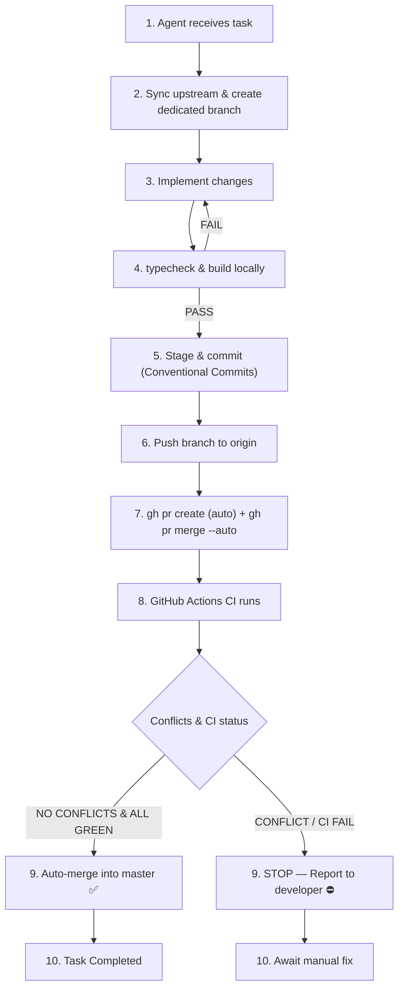

# Agent Git Workflow & Contribution Guidelines

This document defines the **mandatory, fully automated** Git workflow for all AI agents (Antigravity, Claude, Copilot, etc.) contributing to this repository.

> **The developer's only manual action is resolving merge conflicts or CI failures.**  
> Everything else — branch creation, PR, auto-merge — is automated by the agent.

---

## The Agent Lifecycle Chain



---

## 12 Golden Rules for Agents

1. **Never commit directly to `main` / `master`.**  
   All work lives on a dedicated branch. Direct commits to the default branch are strictly prohibited.

2. **Always sync upstream before starting.**  
   Run `git fetch origin` and reset your working base to the latest remote primary branch.

3. **One task = one branch.**  
   Every feature, bugfix, or refactor gets its own branch. Never reuse branches across tasks.

4. **Follow strict branch naming conventions (kebab-case):**
   | Prefix | When to use |
   | :--- | :--- |
   | `feature/<name>` | New game mechanics, systems, UI, networking |
   | `fix/<name>` | Bug fixes, collision, networking patches |
   | `refactor/<name>` | Code cleanup without behavior changes |
   | `chore/<name>` | Tooling, dependency, config updates |
   | `docs/<name>` | Documentation only |
   | `test/<name>` | Adding or improving tests |

5. **Write Conventional Commits (imperative mood).**  
   Format: `<type>(<scope>): <description>`  
   Example: `feat(combat): add piercing projectile behavior`

6. **Always verify locally before pushing.**  
   Both commands must exit with code `0`. Fix all errors before proceeding:
   ```powershell
   npm run typecheck
   npm run build
   ```

7. **Push the branch with upstream tracking.**
   ```powershell
   git push -u origin <branch-name>
   ```

8. **Immediately after push: create PR via `gh` CLI (agent's responsibility).**  
   The agent MUST run these commands right after `git push` — do not rely solely on GitHub Actions:
   ```powershell
   # Create PR (idempotent — skips if PR already exists)
   gh pr create `
     --base master `
     --head <branch-name> `
     --title "<commit title>" `
     --body "$(gh pr view --json body -q .body 2>$null || echo 'Automated PR')"

   # Queue auto-merge (runs as soon as CI passes)
   gh pr merge <branch-name> --auto --merge
   ```
   If `--merge` is blocked by repository settings, fall back to `--squash`:
   ```powershell
   gh pr merge <branch-name> --auto --squash
   ```

9. **Auto-merge runs only when CI is green and there are no conflicts.**  
   - ✅ No conflicts + all checks pass → PR merges automatically, task complete.  
   - ⛔ Merge conflict or CI failure → **STOP IMMEDIATELY**.

10. **On conflict or CI failure: stop and report.**  
    DO NOT attempt to force-merge, bypass checks, or push speculative workarounds.  
    Report to the developer:
    1. Which files conflict / which CI step failed.
    2. Exact error messages or conflict markers.
    3. Suggested manual resolution steps.  
    Then **wait** for the developer to fix and instruct how to continue.

11. **NEVER force-push** (`--force` / `--force-with-lease`) unless the developer explicitly commands it in chat.

12. **Keep commits atomic.**  
    Stage only files directly related to the task. Never include unrelated files, editor artifacts, or temp files.

---

## Step-by-Step Command Playbook

### Step 1 — Sync Upstream

```powershell
git fetch origin
git checkout master          # or: git checkout main
git pull origin master
```

### Step 2 — Create a Dedicated Branch

```powershell
git checkout -b feature/altar-buff-system
# or: fix/enemy-desync, refactor/snapshot-serializer, etc.
```

### Step 3 — Implement & Verify

Make all changes, then:
```powershell
npm run typecheck   # must pass
npm run build       # must pass
```
Fix any errors before moving on.

### Step 4 — Stage & Commit

```powershell
git add src/world/Altar.ts src/combat/DamageNumberManager.ts
git commit -m "feat(world): add altar interaction buffs and visual indicators"
```

#### Commit Type Reference
| Prefix | Purpose | Example |
| :--- | :--- | :--- |
| `feat` | New capability | `feat(drops): add gem magnetic attraction` |
| `fix` | Bug fix | `fix(net): resolve snapshot buffer overflow` |
| `refactor` | No behavior change | `refactor(entities): simplify enemy state machine` |
| `perf` | Performance | `perf(chunks): optimize spatial hash lookup` |
| `chore` | Maintenance | `chore(ci): add build verification workflow` |
| `docs` | Documentation | `docs: update architecture overview` |

### Step 5 — Check for Upstream Divergence

```powershell
git fetch origin
git rebase origin/master
```

If there are conflicts during rebase:
1. Resolve conflicts manually in the affected files.
2. Re-run `npm run typecheck && npm run build`.
3. `git add <resolved-files>`
4. `git rebase --continue`

### Step 6 — Push to Origin

```powershell
git push -u origin <branch-name>
```

### Step 7 — Create PR & Enable Auto-Merge (Agent's Responsibility)

Run **immediately** after push. This is mandatory — the agent must not skip this step:

```powershell
# Capture branch name and last commit info
$BRANCH = git rev-parse --abbrev-ref HEAD
$COMMIT_TITLE = git log -1 --pretty=%s
$COMMIT_BODY  = git log -1 --pretty=%b

# Build PR body
$PR_BODY = @"
### Automated Pull Request
**Branch:** ``$BRANCH``
**Author:** Agent

$COMMIT_BODY

---
*This PR was created automatically by an AI agent. Auto-merge is enabled and will trigger once CI passes and no conflicts exist.*
"@

# Create PR (safe to run even if PR already exists)
$EXISTING = gh pr list --head $BRANCH --json number --jq '.[0].number'
if (-not $EXISTING) {
    gh pr create --base master --head $BRANCH --title $COMMIT_TITLE --body $PR_BODY
} else {
    Write-Host "PR #$EXISTING already exists, skipping creation."
}

# Queue auto-merge
gh pr merge $BRANCH --auto --merge
# If the above fails due to repo settings, try squash:
# gh pr merge $BRANCH --auto --squash
```

> **Note:** The GitHub Actions workflow (`.github/workflows/auto-pr.yml`) acts as a **fallback** in case the agent's local `gh` command fails. The agent-side execution is always the primary mechanism.

### Step 8 — Verify CI & Merge Outcome

After queuing auto-merge, confirm the PR status:

```powershell
# Check PR status
gh pr view $BRANCH --json state,mergeable,statusCheckRollup

# Watch CI checks (optional live view)
gh pr checks $BRANCH --watch
```

**Case A — All green, no conflicts:**
- Auto-merge completes. Task is done. ✅
- Report to the developer: PR number, merge commit SHA, summary of changes.

**Case B — Conflict or CI failure:**
- **STOP IMMEDIATELY.** ⛔
- Run `gh pr checks $BRANCH` and `gh pr view $BRANCH` to collect diagnostic info.
- Report to the developer:
  1. Failing check names and error output.
  2. Conflicting file list (if merge conflict).
  3. Recommended fix steps.
- **Do not push again** until the developer responds with instructions.

---

## CI/CD Automation & GitHub Settings

| Workflow | Trigger | Purpose |
| :--- | :--- | :--- |
| `.github/workflows/ci.yml` | Push to `master`/`main`, any PR | TypeScript type-check + production build on Node 20.x & 22.x |
| `.github/workflows/auto-pr.yml` | Push to `feature/**`, `fix/**`, `refactor/**`, `chore/**`, `docs/**`, `test/**` | **Fallback** auto-PR creation + auto-merge queueing |

### Required GitHub Repository Settings (one-time setup by developer)

1. **Enable Auto-Merge**  
   Settings → General → Pull Requests → ✅ **Allow auto-merge**

2. **Workflow Permissions**  
   Settings → Actions → General → Workflow permissions:
   - ✅ **Read and write permissions**
   - ✅ **Allow GitHub Actions to create and approve pull requests**

3. **Branch Protection Rule for `master`**  
   Settings → Branches → Add rule:
   - ✅ Require status checks to pass before merging
   - Required checks: `Build & Verify (Node 20.x)` and `Build & Verify (Node 22.x)`
   - ✅ Require branches to be up to date before merging
