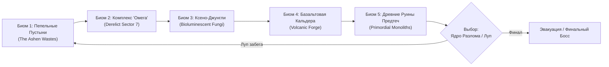
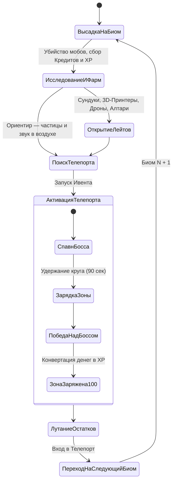
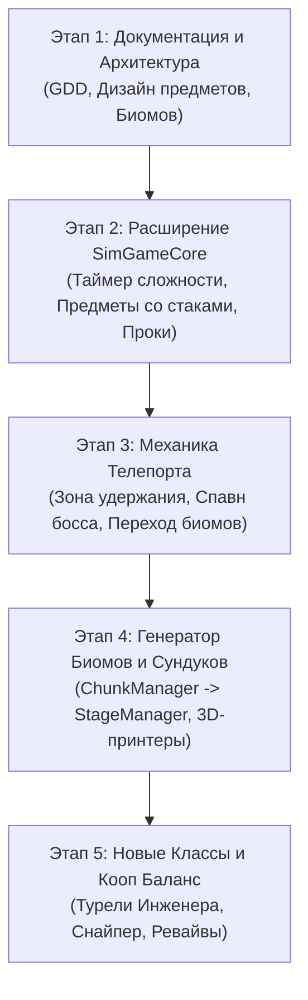

# Game Design Document: The Rift (Разлом)

> **Жанр:** 2.5D Top-Down Action Roguelike / Sci-Fi Co-op Survival  
> **Вдохновение:** *Risk of Rain 2*, *Vampire Survivors*, *Enter the Gungeon*  
> **Камера:** Фиксированная изометрическая / Top-Down (сверху вниз)  
> **Боевая система:** WASD перемещение + Умная автострельба (Auto-aim & Auto-fire) + Активные способности / Гаджеты  
> **Мультиплеер:** Одиночная игра + Кооператив до 5 игроков (P2P WebRTC / Выделенный headless-сервер)

---

## 1. Концепция и Видение Проекта

### 1.1. Главная Идея
**«The Rift»** — это динамичный научно-фантастический кооперативный roguelike с видом сверху, в котором ключевой цикл вдохновлен **Risk of Rain 2**, но адаптирован под молниеносный темп аркадного изометрического экшена с умной автострельбой.

Игроки — выжившие члены экипажа научно-исследовательского судна, потерпевшего крушение на загадочной и враждебной планете **Этельгард (Nexus-IV)**. Мир пронизан гравитационными и пространственными разломами («Рифтами»), непрерывно порождающими волны мутировавших созданий и древних боевых автоматонов.

Главная цель забега — пробиться через несколько смертоносных биомов, накапливая предметы и взрывные синергии, победить Хранителей Телепортов и добраться до ядра Разлома, чтобы активировать эвакуационный челнок или запечатать разлом навсегда.

### 1.2. Столпы Дизайна (Design Pillars)

```
┌────────────────────────────────────────────────────────────────────────┐
│                        СТОЛПЫ ДИЗАЙНА "THE RIFT"                       │
├──────────────────┬──────────────────┬──────────────────┬───────────────┤
│ 1. ВРЕМЯ — ВРАГ  │ 2. СИНЕРГИИ И    │ 3. ВЫСОКАЯ       │ 4. КООП И     │
│                  │    МАСШТАБ СИЛЫ  │    ДИНАМИКА      │    СИНХРОНИЯ  │
├──────────────────┼──────────────────┼──────────────────┼───────────────┤
│ Чем дольше бежит │ Предметы стака-  │ Умная авто-      │ До 5 игроков, │
│ таймер, тем сви- │ ются без ограни- │ стрельба снимает │ синергия ролей│
│ репее враги.     │ чений: цепочки   │ рутину наводки,  │ командные     │
│ Баланс между     │ проков превраща- │ фокус на пози-   │ алтари, общий │
│ лутанием карты и │ ют игрока в бо-  │ ционировании и   │ хаос телепор- │
│ темпом таймера.  │ евую машину.     │ уворотах.        │ тов.          │
└──────────────────┴──────────────────┴──────────────────┴───────────────┘
```

1. **Время — твой главный враг (Time Scaling):**  
   С каждой минутой ползунок сложности смещается вверх. Враги получают больше здоровья, скорости и урона, появляются грозные элитные монстры с аффиксами. Игрок постоянно решает дилемму: потратить лишние 2 минуты на открытие дальнего золотого сундука или сразу активировать Телепорт, пока сложность не улетела в космос.
2. **Стек предметов и Цепочки Проков (Proc Chains):**  
   Предметы пассивны и бесконечно стакаются. Удар накладывает горение → крит вызывает взрыв плазмы → взрыв порождает цепную молнию → молния активирует вампиризм. Билдостроение открывает колоссальное поле для экспериментов.
3. **Умная автострельба и фокус на движении (Bullet-Hell & Positioning):**  
   Игроку не нужно целиться мышью в трёхмерном пространстве. Оружие автоматически захватывает ближайшие опасные цели с приоритетом элиты и боссов, а игрок концентрируется на позиционировании, кайтинге сотен врагов, таймингах дэшей и активации классовых умений.
4. **Кооператив на 1–5 игроков без просадок:**  
   Синхронизация через модульное ядро `GameCore` (симуляция на клиенте-хосте или VPS-сервере), общие события Телепорта, оживление павших союзников на следующем уровне и совместные комбо.

---

## 2. Сеттинг и Биомы

Планета **Этельгард** разорвана на секторы древней инопланетной катастрофой. Каждый забег состоит из последовательного прохождения процедурно заполняемых биомов.



### 2.1. Описание Биомов

| Биом | Визуальный стиль | Уникальные угрозы и интерактивности | Типы врагов и Элита |
| :--- | :--- | :--- | :--- |
| **1. Пепельные Пустыни (The Ashen Wastes)** | Ржавый песок, дюны, разбившиеся спасательные капсулы, скелеты гигантских тварей | Песчаные воронки, геотермальные гейзеры, дающие ускорение прыжка | Песчаные жуки-землерои, роящиеся дроны-падальщики, Грязевой Голем |
| **2. Комплекс «Омега» (Derelict Sector 7)** | Полуразрушенные лаборатории, неоновые панели, пробитые коридоры, экраны терминалов | Лазерные барьеры, токсичные разливы энергохладагента, турели защиты | Дефектные боевые андроиды, парящие турели, Штурмовой Сервитор |
| **3. Ксено-Джунгли (Bioluminescent Wilds)** | Темный фиолетово-зеленый инопланетный лес, светящиеся гигантские грибы, споровые туманы | Взрывающиеся споровые мешки, светящиеся лужи регенерации | Плюющиеся токсином споровики, многоногие сталкеры, Споровая Королева |
| **4. Базальтовая Кальдера (Volcanic Forge)** | Черный обсидиан, лавовые реки, раскаленный металл, плазменные гейзеры | Лавовые потоки (периодический урон при наступании), выбросы пепла | Магматические виверны, огненные элементали, Магма-Червь |
| **5. Руины Предтеч (Primordial Monoliths)** | Парящие золотые и призматические монолиты, антигравитационные плиты, древние письмена | Гравитационные колодцы, силовые платформы перемещения | Каменные Стражи-Титаны, летающие кинетические призмы, Хранитель Разлома |
| **6. Ядро Разлома (The Rift Core — Финал)** | Пространственный шторм, искаженная гравитация, осколки миров, посадочная площадка корабля | Всплески антиматерии, разрушающиеся секции арены | Финальный Босс: **«Архитектор Разлома»** + таймер эвакуации челнока (2:00) |

---

## 3. Базовый Игровой Цикл (Core Gameplay Loop)

Игровой цикл следует формуле Risk of Rain 2, адаптированной под динамичный изометрический бой:



### 3.1. Этапы прохождения локации:
1. **Высадка на биом:**  
   Игроки появляются рядом с десантной капсулой. Таймер запускается с `00:00`.
2. **Фарм и Экономика (Кредиты Разлома / Plasma Credits):**  
   - За убийство мобов мгновенно начисляются **Кредиты** (деньги локации) и **XP** (уровень персонажа).  
   - За Кредиты открываются сундуки различных размеров, восстанавливаются боевые дроны и активируются алтари.  
   - *Важно:* Кредиты не переносятся между локациями! При завершении Телепорта все оставшиеся деньги автоматически конвертируются в опыт персонажа.
3. **Поиск и Активация Телепорта:**  
   - На карте спрятан древний Телепорт. Вокруг него в воздухе вьются едва заметные искрящиеся частицы разлома (как в RoR2), подсказывающие игрокам направление.  
   - При нажатии активации запускается **«Ивент Телепорта»**:
     - Вокруг телепорта формируется радиус зарядки (~35–40 метров).
     - Появляется уникальный **Босс Биома** (или орда Элитных боссов на высоких сложностях).
     - Начинается 90-секундный отсчет зарядки, который идет только тогда, когда хотя бы один живой игрок находится внутри круга.
4. **Завершение События и Переход:**  
   - Когда зарядка достигает 100% и Босс побежден, музыка стихает, мобы перестают спавниться.  
   - Выпадает уникальный трофейный сундук босса.  
   - Игроки получают пару минут на то, чтобы докупить оставшиеся сундуки на карте за конвертированные ресурсы, после чего активируют Телепорт и переносятся в следующий биом.

---

## 4. Система Управления и Камера

### 4.1. Камера
- **Перспектива:** Фиксированная 2.5D изометрическая камера с наклоном 50–60° к горизонту.
- **Плавное следование (Smooth Lerp):** Камера следует за персонажем с легким упреждением по вектору движения (Lookahead). В кооперативе при удалении союзников поддерживается динамический зум или индивидуальный рендеринг экрана для каждого игрока.

### 4.2. Управление
- **WASD / Левый стик геймпада:** Перемещение персонажа во всех направлениях.
- **Автострельба (Auto-aim & Auto-fire):**  
  Оружие ведет непрерывный огонь по целям в зоне поражения без необходимости кликать мышью.  
  *Приоритет авто-прицеливания:*
  1. Ближайшие угрозы на дистанции удара.
  2. Элитные противники с опасными аффиксами.
  3. Боссы биома.
- **Пробел / Shift (Utility - Мобильность):**  
  Рывок / Тактический перекат с кадрами неуязвимости (i-frames 0.25 сек) и преодолением лавовых трещин.
- **Клавиша Q / E (Special - Классовые умения):**  
  Уникальные активные способности (установка турели, бросок крио-гранаты, плазменный залп).
- **Клавиша R (Equipment - Артефакт):**  
  Активируемое снаряжение длительного отката (Орбитальный удар, Радар сундуков, Защитный щит).
- **Клавиша E / F (Interact):**  
  Взаимодействие: открыть сундук, запустить 3D-принтер, активировать телепорт.

---

## 5. Динамическая Сложность: Система «Директор Времени»

Сложность растет каждую секунду. Никаких пауз — каждая потраченная минута делает мир беспощаднее.

```
[0:00 - 3:00]   ЛЕГКО          (Простые мобы, малый спавн)
[3:00 - 6:00]   НОРМАЛЬНО      (Повышение здоровья врагов, базовые стаи)
[6:00 - 9:00]   СЛОЖНО         (Появление первых элитных мобов)
[9:00 - 13:00]  БЕЗУМИЕ        (Массированные орды, агрессивные атаки)
[13:00 - 18:00] НЕВОЗМОЖНО     (Множественные элиты, гигантский урон)
[18:00 - 25:00] Я ВИЖУ ТЕБЯ    (Экстремальный хаос, спавн боссов в виде обычных мобов)
[25:00+]        КОНЕЦ МИРА     (Предел выживания: выживут только богоподобные билды)
```

### 5.1. Формула Директора (Director AI)
Каждые $dt$ секунд спавн-директор начисляет себе очки спавна (Spawn Credits) по формуле:
$$DifficultyCoefficient = (1 + 0.05 \cdot t_{min}) \cdot (1 + 0.3 \cdot (Players - 1)) \cdot 1.15^{Stage - 1}$$
- Здоровье монстров: $HP = HP_{base} \cdot DifficultyCoefficient^{1.1}$
- Урон монстров: $DMG = DMG_{base} \cdot (1 + 0.15 \cdot DifficultyCoefficient)$
- Стоимость открытия сундуков также масштабируется со временем, стимулируя постоянный активный фарм.

### 5.2. Аффиксы Элитных Противников
Элитные монстры окрашиваются в характерные светящиеся цвета и обладают опасными пассивными аурами:
1. **Пылающие (Blazing — Красная аура):** Оставляют за собой след огня, наносящий урон, атаки поджигают игроков.
2. **Перегруженные (Overloading — Синяя молния):** Имеют 50% щита от макс. HP, при атаках вызывают взрывные электрические сферы, прилипающие к игроку.
3. **Ледяные (Glacial — Бело-голубые кристаллы):** Замедляют при ударе, после гибели взрываются ледяной сверхновой с задержкой в 1.5 секунды.
4. **Малахитовые (Malachite — Темно-изумрудные шипы):** Стреляют самонаводящимися шипами, их аура полностью блокирует регенерацию и лечение игроков на 5 секунд.
5. **Призрачные / Теневые (Void / Shadow):** Периодически совершают микро-телепортации сквозь снаряды игроков.

---

## 6. Предметы, Синергии и Экономика

В «The Rift» сила персонажа определяется не только уровнем, но и накопленными пассивными артефактами. Предметы делятся на категории редкости и обладают неограниченным стаком (Stacking).

```
┌─────────────────────────────────────────────────────────────┐
│                    ТИРЫ ПРЕДМЕТОВ В РАЗЛОМЕ                 │
├─────────────────┬─────────────────┬─────────────────────────┤
│ Редкость        │ Цвет            │ Роль в билде            │
├─────────────────┼─────────────────┼─────────────────────────┤
│ Common (Белые)  │ Белый / Серый   │ Фундамент статов и шанс │
│ Uncommon (Зелен)│ Неоново-зеленый │ Синергии и АОЕ эффекты  │
│ Legendary (Крас)│ Багрово-красный │ Гейм-чейнджеры билда    │
│ Boss (Желтые)   │ Золотой         │ Дропы с уникальных босс.│
│ Corrupted (Фиол)│ Фиолетовый      │ Высокий риск / мутации  │
│ Equipment (Оран)│ Оранжевый       │ Активные по кнопке 'R'  │
└─────────────────┴─────────────────┴─────────────────────────┘
```

### 6.1. Примеры Предметов

#### Обычные (Common / Белые) — Основа билда:
- **Кинетический Ускоритель (Kinetic Injector):** +15% к скорострельности (+15% за стак).
- **Титановая Нано-Броня (Nanite Plating):** Снижает входящий урон на 5 ед. (+5 за стак, не ниже 1).
- **Стимулятор Сердца (Adrenaline Dart):** +12% к скорости бега при получении урона.
- **Импульсный Патрон (Pulse Rounds):** 10% шанс вызвать кровотечение (наносит 240% урона за 3 сек).
- **Био-Инжектор (Health Vial):** Регенерация +2 HP в секунду (+2 за стак).

#### Необычные (Uncommon / Зеленые) — Синергии и масштабирование:
- **Тесла-Катушка (Chain Lightning Coil):** 25% шанс при выстреле поразить молнией до 3 (+2 за стак) врагов на 160% урона.
- **Плазменный Детонатор (Plasma Core):** Убийство врага вызывает взрыв радиусом 4м на 200% базового урона.
- **Очки Снайпера (Crit Visor):** +10% к шансу критического удара (+10% за стак). Критический урон равен 200%.
- **Автономный Дрон-Охранник (Uplink Node):** Призывает парящего боевого дрона, повторяющего 30% залпов игрока.
- **Гипер-Щит Защиты (Aegis Battery):** При непрерывном беге в течение 4 сек генерирует щит на 25% от максимального HP.

#### Легендарные (Legendary / Красные) — Богоподобная мощь:
- **Ядро Сингулярности (Singularity Core):** Каждое 10-е убийство создает мини-черную дыру, стягивающую всех мобов в радиусе 12м и взрывающуюся на 800% урона.
- **Протокол «Омни-Лазер» (Orbital Strike Protocol):** Каждые 15 секунд орбитальный спутник обрушивает луч дезинтеграции на самого живучего врага в радиусе видимости.
- **Кристалл Бессмертия (Chronos Phylactery):** При получении смертельного урона замораживает время вокруг игрока на 3 секунды и восстанавливает 50% HP (перезарядка 1 раз за локацию).
- **Катализатор Реакций (Resonance Amplifier):** Все эффекты периодического урона (огонь, яд, кровотечение) тикают в 2 раза быстрее и могут критовать.

#### Предметы Боссов (Boss / Желтые):
- **Око Титана (Golem Core):** Периодически выстреливает каменный луч во врагов, оглушая их на 2 секунды.
- **Огненная Чешуя Магма-Червя (Molten Scale):** Под ногами персонажа всегда горит земля, наносящая урон врагам пропорционально скорости бега.

#### Искаженные Реликвии (Corrupted / Фиолетовые):
- Мутируют существующие предметы. Например: трансформирует все «Очки Снайпера» в «Очки Разлома» — шанс крита равен 0, но все атаки имеют 1% шанс мгновенно аннигилировать любого не-босс противника.

### 6.2. Механики Манипуляции Предметами на Карте
1. **3D-Принтеры (Item Fabricators):** Позволяют отдать случайный предмет соответствующей редкости ради гарантированного получения указанного полезного предмета.
2. **Утилизаторы (Scrappers):** Позволяют превратить ненужные предметы в чистый «Лом» (Scrap), который принтер будет расходовать в первую очередь!
3. **Жертвенные Алтари (Shrines):**
   - *Алтар Шанса:* Заплати деньги ради шанса выбить ценный артефакт (или проиграть).
   - *Алтарь Битвы:* Немедленно спавнит двух опасных элитных мобов; награда — сундук.
   - *Алтарь Крови:* Отдай 50% текущего HP ради солидной пачки кредитов.

---

## 7. Классы Выживших (Персонажи)

Каждый персонаж имеет уникальный стиль боя, базовое автоматическое оружие и набор активных способностей:

```
┌────────────────────────────────────────────────────────────────────────┐
│                        ВЫЖИВШИЕ ЭКИПАЖА РАЗЛОМА                        │
├──────────────────┬──────────────────┬──────────────────┬───────────────┤
│ 1. СКАУТ         │ 2. ДЖАГГЕРНАУТ   │ 3. ИНЖЕНЕР       │ 4. МИСТИК     │
│    (Commando)    │    (Juggernaut)  │    (Engineer)    │    (Techno)   │
├──────────────────┼──────────────────┼──────────────────┼───────────────┤
│ - Двойные бласт. │ - Дробовик плазмы│ - Автомат + 2    │ - Энерго-лучи │
│ - Высокая скор.  │ - Силовой щит    │   турели со ста- │ - Телепортация│
│ - Осколочная     │ - Землетрясение  │   ками предметов │ - Черная дыра │
│   граната        │ - Огромное HP    │ - Мины-пауки     │ - Стихии      │
└──────────────────┴──────────────────┴──────────────────┴───────────────┘
```

1. **Скаут (The Scout / Commando):**  
   - *Оружие:* Спаренные импульсные пистолеты (высокая скорострельность, идеален для прок-билдов).  
   - *Utility (Shift):* Тактический кувырок (ускорение, уклонение).  
   - *Special (Q):* Кластерная нано-граната, взрывающаяся на множество осколков.
2. **Джаггернаут (The Juggernaut / Enforcer):**  
   - *Оружие:* Тяжелый плазменный дробовик (конус мощного урона на близкой дистанции, отталкивание).  
   - *Utility (Shift):* Рывок щитом вперед с опрокидыванием врагов.  
   - *Special (Q):* Стационарный энерго-барьер, блокирующий все вражеские снаряды спереди.
3. **Инженер (The Engineer):**  
   - *Оружие:* Игольчатый карабин с самонаводящимися микро-дротиками.  
   - *Utility (Shift):* Защитный купол, регенерирующий щиты союзников внутри.  
   - *Special (Q):* Установка автономных турелей «Гаусс» (до 2 штук). **Главная фишка: турели наследуют 100% всех предметов инженера!**
4. **Ксено-Мистик (The Mystic / Artificer):**  
   - *Оружие:* Чередующиеся плазменные сгустки огня, холода и молнии.  
   - *Utility (Shift):* Фазовый сдвиг (кратковременный полет в виде чистой энергии сквозь врагов).  
   - *Special (Q):* Заряжаемая сингулярность, замораживающая и стягивающая врагов.
5. **Снайпер-Следопыт (The Ranger):**  
   - *Оружие:* Бронебойная рельсовая винтовка (высокий урон за выстрел, пробивает мобов насквозь).  
   - *Utility (Shift):* Пространственный блинк (прыжок сквозь материю).  
   - *Special (Q):* Дрон-разведчик, подсвечивающий уязвимые точки боссов (+100% к урону по ним).

---

## 8. Кооперативный Мультиплеер (До 5 Игроков)

Кооператив рассчитан на совместное прохождение в команде до 5 человек. Игра поддерживает как локальные сессии через WebRTC (P2P Mesh/Star с хостом), так и выделенный сервер на базе Node.js/Bun.

### 8.1. Динамическое Масштабирование Коопа
- **Здоровье врагов:** $+35\%$ за каждого дополнительного игрока в лобби.
- **Количество сундуков на карте:** Увеличивается пропорционально числу игроков, чтобы каждый мог собрать сильный билд.
- **Радиус телепорта:** Зарядка ускоряется, если в круге находится больше живых игроков.

### 8.2. Система Павших Бойцов (Revive & Spectate)
- Если здоровье игрока падает до нуля, он переходит в состояние «Нокдауна» (Downed). Союзники могут подбежать и реанимировать его в течение 20 секунд.
- Если таймер истек или вся команда не успела оживить бойца, он переходит в режим наблюдения (Spectator).
- **Возрождение:** Все павшие союзники автоматически возрождаются с полным запасом сил при успешной активации и зарядке Телепорта текущего биома!

---

## 9. Техническая Интеграция в Архитектуру Проекта

Проект уже обладает модульной архитектурой:
- **Headless симуляция (`src/sim/GameCore.ts`):** Вся математика мобов, таймеров, коллизий и урона полностью независима от Three.js.
- **Презентационный слой Three.js (`src/core/Renderer.ts`, `entities/`):** Визуализация 2.5D мира, эффектов частиц, шейдеров разлома.
- **Сетевой стек (`src/net/PeerNetwork.ts`, `server/dedicatedServer.ts`):** Поддержка синхронизации снапшотов.

### Дорожная Карта Перехода (Implementation Roadmap)



1. **Этап 1 (Текущий):** Фиксация дизайн-документа концепции «The Rift», согласование механик.
2. **Этап 2 (Ядро симуляции):** Добавление в `GameCore` глобального таймера сложности (Difficulty Scale), структуры предметов со стаками и диспетчера событий проков (Proc Trigger Engine).
3. **Этап 3 (Событие Телепорта):** Создание сущности `Teleporter` с логикой радиуса зарядки (90 сек), спавном босса биома и конвертацией кредитов при завершении.
4. **Этап 4 (Мир и Биомы):** Перевод генерации из бесконечного пустого чанка в ограниченные красивые карты биомов (Desert, Tech, Forest, Volcano, Ruins) с точками интереса.
5. **Этап 5 (Полировка и Сеть):** Добавление визуальных эффектов разлома, звукового сопровождения, сетевой синхронизации телепорта и оживления игроков.
